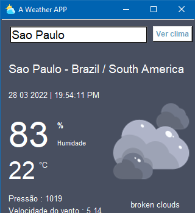

# Weather APP project
> Construção de um app de tempo para cidades do mundo todo utilizando uma API weather.

Esse projeto utiliza um API para buscar o nome da cidade, país e continente e traz a hora, temperatura, humidade, como se encontra o tempo (nublado, limpo). O usuário forcenece o nome da cidade que ele quer e a API fará a requisição das informações.

---
## Módulos
Foram utilizados os módulos Tkinter, PIL (pillow), datetime, pytz, pycountry_converter e requests.

## Usos
Esse projeto é um inicio para aprender a utilizar APIs e construções um pouco mais complexas de um aplicativo simples usando interface Tkinter.